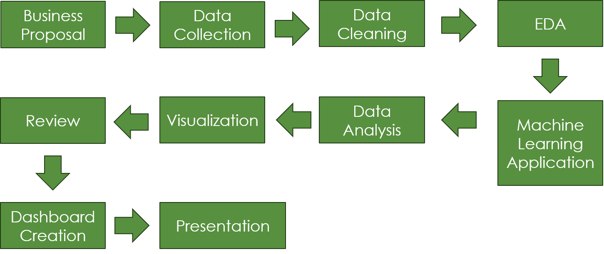

# AI-Driven_Fundraising_Models
Fundraising in higher education institutions has evolved in recent years where a large part was played by the increasing adoption of online donation platforms. This online shift, accelerated by the COVID-19 pandemic, has reshaped how colleges and universities connect with donors to secure funding to meet financial demands that the institution alone cannot cover. Fundraising efforts play an integral part in supporting everything from student financial aid and facility upgrades to operational expenses making it essential for institutions to adapt to the changing expectations of their donor base.

## Business Needs
The success of fundraising campaigns in higher education institutions relies a lot on understanding and adapting to donor behaviors. Generational shifts in giving habits in recent years have presented a lot of different challenges in maintaining consistent campaigns that can effectively reach different demographic groups. Fortunately, several technological advancements offer new opportunities to easily identify trends and allow for a more seamless donation process. It is important to understand how higher education institutions can leverage this transition not only to help the students and staff, but also the community surrounding them. This project will aim to analyze these trends to better understand how to improve fundraising efforts to enable the university to better communicate the needs of the institution to donors across different age groups. By doing so, institutions can optimize their fundraising strategies to ensure financial sustainability and fulfill their educational missions in an ever-changing philanthropic landscape.

## Problem Statement
This study seeks to address this gap by examining the impact of technological advancements on fundraising practices, focusing on the transition to online donation platforms and its implications for donor engagement and fundraising efficiency in higher education.

## Minimum Viable Product 
1. Donor Behavior Overview
Percentage of online vs offline donors
Average donation amount (online vs offline)
Age distribution of online donors
2. Donation Trends
Comparison of online donation growth to overall donation growth
3. Recent Campaign Performance
Analysis of the results from the recently closed campaign
Online vs offline gifts comparison

## High Level Architecture

## Credit: Kristopher 
